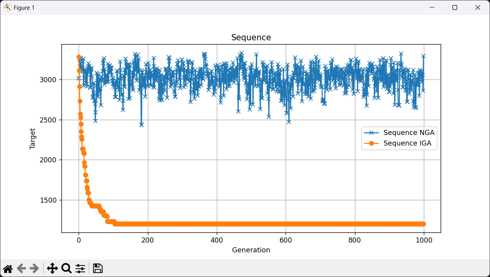

## Requirements
- C++ Make
- gcc version >= 4.8.1
- python3 with pandas and matplotlib

## Instruction

- Project Structure

```
GA-Project
│   figure.py   # Scripts for making figure
│   IGA.cpp     # Improved Genetic Algotithm
│   Makefile    # Makefile for Make
│   map.cpp     # Map generator
│   NGA.cpp     # Normal Genetic Algorithm
│   README
└─ images
    image.png
```

- Makefiles Function

After the construction of project, result folder and map.txt file was created.

```
map.txt         # Map file: cityNum and distance[i][j] 
result
|   IGA.log     # Log file of IGA (solution and target of each generation)
|   IGA.seq     # Result target sequence of IGA 
|   NGA.log     # Log file of NGA (solution and target of each generation)
|   NGA.log     # Result target sequence of NGA 
```

## Usage

- Construct the Hole Project:

If you want to run the entire project, simply type `make` in the command line. The `make` tool will automatically handle the compilation of all files and the construction of the directories, ultimately calling `figure.py` to generate images of the results from the genetic algorithm. 

```bash
$ make
```

- Generate a New Map:

```bash
$ make map
``` 

- Generate a Figure of Results:

If you wish to update the map file `map.txt`, just enter `make map` and then `make figure`, and it will automatically generate the new map and draw the new image. 

```bash
$ make figure
```

-  Clear Runtime Makefiles:

If you want to clean up the clutter of generated runtime files after running, simply type `make clean`, and the program will automatically delete the generated files for you.

```bash
$ make clean
```

